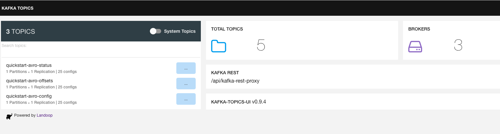
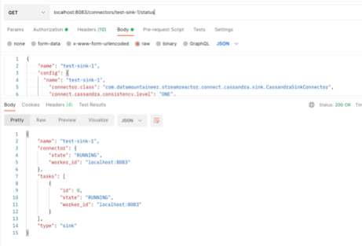

## **Lab 01: Kafka Connect Setup & Creation of Internal Topics**

## Description

In this lab, you will setup the lab environment and create the internal topics used by Kafka Connect. The lab environment consists of a container network created by Docker Compose. The Docker Compose file allows us to spin up a Kafka platform to run the application locally. All you should need to create the environment is Docker installed and running.

## Lab Instructions

## **Part 1: Forking, cloning, and adding upstream to the project**

1.	Navigate to the following url:

      https://github.com/raghaviCJanaswamy/kafkaconnect-source-sink-trial.git

2.	Fork the project to your own GitHub account.

    a.	Click the Fork button.
        
    b.	Select the account to which the project will be forked.

3.	Clone the forked repo to your workstation:

      git clone <fork-url>

## **Part 2: Starting the Kafka Platform**

The root directory of the project has a docker compose yaml file that allows you to spin up all the components of the Kafka platform with a simple command. Once the command is run, docker compose will spin up the following components:

    •	Kafka
    •	Zookeeper
    •	Schema Registry
    •	Kafka UI
    •	MySQL DB

Occasionally, a container may crash, and you will notice odd behavior in the platform. If this occurs, you can resolve the issue by running <b>docker-compose up -d </b> command.

1.	Make sure Docker is running on your system.
2.	Execute the command:

      docker compose -f docker-compose-mac.yml up -d

3.	Once the containers are spun up, complete the following tests to ensure the services are up and running.

4. Test the Kafka UI by navigating to     [Kafka Console - http://localhost:8000](http://localhost:8000)

5. Test the MySQL DB UI by navigating   [MySQL Console - http://localhost:8090](http://localhost:8090)

                i.	Username: user
                ii.	Password: password
                iii.Server: db
                iv.	Database: db

6. Test the schema registry by navigating to
   [Kafka - Schema Registry - http://localhost:8081](http://localhost:8081)

## **Part 3: Create Internal Topics Used by Kafka Connect**

Now that we have the Kafka platform up and running, we need to create the internal Kafka topics that will be used by Kafka Connect. All Kafka Connect clusters require three internal topics:

    a) The Config topic stores connector and task configuration data
    b) The Offset topic stores offset data for connectors 
    c) The Status topic stores status updates for connectors and tasks

The config topic should always be a single partition and be highly replicated. The offset topic should have a large number of partitions and be highly replicated, and the status topic can have multiple partitions and should be highly replicated.

### 1.	Create the Config topic by entering the following:

    docker run \
    --net=host \
    --rm \
    confluentinc/cp-kafka:5.0.0 \
    kafka-topics --create --topic quickstart-avro-offsets  --partitions 1 --replication-factor 1 --config "cleanup.policy=compact" --if-not-exists --zookeeper localhost:2181

### 2.	Create the Offsets topic by entering the following:

    docker run \
    --net=host \
    --rm \
    confluentinc/cp-kafka:5.0.0 \
    kafka-topics --create --topic quickstart-avro-config  --partitions 1 --replication-factor 1 --config "cleanup.policy=compact" --if-not-exists --zookeeper localhost:2181

### 3.	Create the Status topic by entering the following

    docker run \
      --net=host \
      --rm \
      confluentinc/cp-kafka:5.0.0 \
      kafka-topics --create --topic quickstart-avro-status  --partitions 1 --replication-factor 1 --config "cleanup.policy=compact" --if-not-exists --zookeeper localhost:2181

##  **Checkpoints**
[Kafka Console - http://localhost:8000](http://localhost:8000)

## **Lab 02: Source Connectors to push data from MySQL to Kafka**
## Description
In this lab, you will setup the source connectors, insert data into the MySQL database, start the Kafka Connect Cluster, and start the sink connector. At the end of the lab, you will have the source connector connected to the Kafka Connect Cluster. In addition, a new Kafka topic will be generated by the source connector with the data from the MySQL database posted to the topic.

### **Lab Instructions**

## **Part 1: Move Jars**

        from Git repo location jars folder to /tmp/quickstart/jars

• There are 3 jar files/folders located in “Jar” folder under the git repository.

• These are the source, sink connectors along with driver libraries required to move the data to and from kafka.

In this section, the directory structure - /tmp/quickstart/jars needs to be created and all jars and its folders located in the git repo location needs to be moved under this folder. Please refer to the screenshots:

a) Make the directory structure

b) Navigate to streams-platform git repo’s jar folder and Copy jars from this location to /tmp/quickstart/jars and verify the folder structure matches git repo’s structure.

**Note**: It is not necessary to move these jars into a different location, however, changes in the later part of labs need to be performed in order to properly start the kaka connector.
** Checkpoint**

### **Part 2: Insert Data into MySQL Database**

1.	Access the MySQL UI: [http://localhost:8090](http://localhost:8090)
2.	Create a new database by entering the following:
 

    DROP TABLE IF EXISTS test;
                                                          
                                                          
                                                              CREATE TABLE IF NOT EXISTS test (
                                                                id serial NOT NULL PRIMARY KEY,
                                                                name varchar(100),
                                                                email varchar(200),
                                                                department varchar(200),
                                                                modified timestamp default CURRENT_TIMESTAMP NOT NULL,
                                                                INDEX `modified_index` (`modified`)
                                                              );
                                                          
                                                              INSERT INTO test(name, email, department) VALUES ('alice1', 'alice@abc.com', 'engineering');
                                                              INSERT INTO test (name, email, department) VALUES ('bob1', 'bob@abc.com', 'sales');
                                                              INSERT INTO test (name, email, department) VALUES ('bob2', 'bob@abc.com', 'sales');
                                                              INSERT INTO test (name, email, department) VALUES ('bob3', 'bob@abc.com', 'sales');
                                                              INSERT INTO test (name, email, department) VALUES ('bob4', 'bob@abc.com', 'sales');
                                                              INSERT INTO test (name, email, department) VALUES ('bob5', 'bob@abc.com', 'sales');
                                                              INSERT INTO test (name, email, department) VALUES ('bob7', 'bob@abc.com', 'sales');
                                                              INSERT INTO test (name, email, department) VALUES ('bob8', 'bob@abc.com', 'sales');
                                                              INSERT INTO test (name, email, department) VALUES ('bob9', 'bob@abc.com', 'sales');

** Checkpoint**  Verify the database records

### **Part 3: Start the Kafka Connect Cluster**

1.	Open a new terminal.
2.	Enter the following:

      docker run  \
      --name=kafka-connect-avro-1 \
      --network=streams-platform_default \
      -e CONNECT_BOOTSTRAP_SERVERS=broker1:19092 \
      -e CONNECT_REST_PORT=8083 \
      -e CONNECT_GROUP_ID="quickstart-avro-1" \
      -e CONNECT_CONFIG_STORAGE_TOPIC="quickstart-avro-config" \
      -e CONNECT_OFFSET_STORAGE_TOPIC="quickstart-avro-offsets" \
      -e CONNECT_STATUS_STORAGE_TOPIC="quickstart-avro-status" \
      -e CONNECT_CONFIG_STORAGE_REPLICATION_FACTOR=1 \
      -e CONNECT_OFFSET_STORAGE_REPLICATION_FACTOR=1 \
      -e CONNECT_STATUS_STORAGE_REPLICATION_FACTOR=1 \
      -e CONNECT_KEY_CONVERTER="io.confluent.connect.avro.AvroConverter" \
      -e CONNECT_VALUE_CONVERTER="io.confluent.connect.avro.AvroConverter" \
      -e CONNECT_KEY_CONVERTER_SCHEMA_REGISTRY_URL="http://schema-registry:8081" \
      -e CONNECT_VALUE_CONVERTER_SCHEMA_REGISTRY_URL="http://schema-registry:8081" \
      -e CONNECT_INTERNAL_KEY_CONVERTER="org.apache.kafka.connect.json.JsonConverter" \
      -e CONNECT_INTERNAL_VALUE_CONVERTER="org.apache.kafka.connect.json.JsonConverter" \
      -e CONNECT_REST_ADVERTISED_HOST_NAME="localhost" \
      -e CONNECT_LOG4J_ROOT_LOGLEVEL=INFO \
      -e CONNECT_PLUGIN_PATH=/usr/share/java,/etc/kafka-connect/jars \
      -v /tmp/quickstart/files:/tmp/quickstart \
      -v /tmp/quickstart/jars:/etc/kafka-connect/jars \
      --publish 8083:8083 \
      docker.repo1.uhc.com/confluentinc/cp-kafka-connect:latest

## **Checkpoint**

Verify Kafka connect cluster has started:

[http://localhost:8083](http://localhost:8083)

### Part 4: Start the Source Connector

1.	Enter the following to add configuration to start source connector:

      curl -X POST \
      -H "Content-Type: application/json" \
      --data '{ "name": "quickstart-jdbc-source", "config": { "connector.class": "io.confluent.connect.jdbc.JdbcSourceConnector", "tasks.max": 1, "connection.url": "jdbc:mysql://streams-platform-db-1:3306/db?user=user&password=password", "mode": "incrementing", "incrementing.column.name": "id", "timestamp.column.name": "modified", "topic.prefix": "AKK_", "poll.interval.ms": 1000 , "transforms": "ValueToKey","transforms.ValueToKey.type":"org.apache.kafka.connect.transforms.ValueToKey","transforms.ValueToKey.fields":"name"} }' \
      http://127.0.0.1:8083/connectors

## **Checkpoint**

Verify the connectors created.

2.	This starts the source connector which connects to the MySQL database and creates a Kafka topic prefixed with AKK_test with values taken from the MySQL database.

3.	Verify kafka connect source connector is correctly added: This can be checked by going to the ^^ http url.

## **Checkpoint**
Verify the Kafka Topic Created with the data in the topics.

## **Checkpoint**
Verify Data in Kafka Topic

## **Lab 03: Sink Connector to push data from kafka - Cassandra**
## Description
In this lab, you will setup the Cassandra database and create the sink connector which connects Cassandra to the Kafka Connect cluster. This is the final step in connecting the MySQL and Cassandra databases using Kafka Connect.

### **Lab Instructions**

### **Part 1: Setup and Test Cassandra**

1.	Enter the following to view the docker network:

      docker network ls

2.	Find the streams_platform network name and run: docker network inspect <streams_platform network name>
3.	This displays all the internal network configurations for the docker network. Locate the IPV4 address of Cassandra. Run the following command and insert the IPV4 address for the Cassandra_Host_IP:

      docker run -d \
      --network=streams-platform_default \
      -e CASSANDRA_HOST_IP=172.21.0.3  \
      -e CASSANDRA_PORT=9042 \
      -p 3000:3000 \
      --name cassandra-web \
      delermando/docker-cassandra-web:v0.4.0

4.	Check to make sure the database is working by navigating to

      http://localhost:3000

5.	Create a keyspace by running:

      CREATE KEYSPACE test WITH replication = {'class': 'SimpleStrategy', 'replication_factor': '3'} AND durable_writes = true;

### **Part 2: Create the Database and the table in C***

a) Navigate to Cassandra UI:
http://localhost:3000

b) Create the database: Cassandra_sink using the following DDL:

    CREATE KEYSPACE cassandra_sink WITH replication = {'class': 'SimpleStrategy', 'replication_factor': '2'} AND durable_writes = true;

c) Create the table: akk_test under the above database by executing the following:

    CREATE TABLE cassandra_sink.AKK_test (
    id int,
    name text,
    email text,
    department text,
    PRIMARY KEY (id))

### **Part 3: Stop running kafka connector and restart with Cassandra connection env variables:**
    docker run  \
    --name=kafka-connect-avro-1 \
    --network=streams-platform_default \
    -e CONNECT_BOOTSTRAP_SERVERS=broker1:19092 \
    -e CONNECT_REST_PORT=8083 \
    -e CONNECT_GROUP_ID="quickstart-avro" \
    -e CONNECT_CONFIG_STORAGE_TOPIC="quickstart-avro-config" \
    -e CONNECT_OFFSET_STORAGE_TOPIC="quickstart-avro-offsets" \
    -e CONNECT_STATUS_STORAGE_TOPIC="quickstart-avro-status" \
    -e CONNECT_CONFIG_STORAGE_REPLICATION_FACTOR=1 \
    -e CONNECT_OFFSET_STORAGE_REPLICATION_FACTOR=1 \
    -e CONNECT_STATUS_STORAGE_REPLICATION_FACTOR=1 \
    -e CONNECT_KEY_CONVERTER="io.confluent.connect.avro.AvroConverter" \
    -e CONNECT_VALUE_CONVERTER="io.confluent.connect.avro.AvroConverter" \
    -e CONNECT_KEY_CONVERTER_SCHEMA_REGISTRY_URL="http://schema-registry:8081" \
    -e CONNECT_VALUE_CONVERTER_SCHEMA_REGISTRY_URL="http://schema-registry:8081" \
    -e CONNECT_INTERNAL_KEY_CONVERTER="org.apache.kafka.connect.json.JsonConverter" \
    -e CONNECT_INTERNAL_VALUE_CONVERTER="org.apache.kafka.connect.json.JsonConverter" \
    -e CONNECT_REST_ADVERTISED_HOST_NAME="localhost" \
    -e CONNECT_LOG4J_ROOT_LOGLEVEL=INFO \-e connect_cassandra_contact_point="cassandra" \
    -e connect_cassandra_port="9042" \
    -e connect_cassandra_username="" \
    -e connect_cassandra_password="" \
    -e CONNECT_PLUGIN_PATH=/usr/share/java,/etc/kafka-connect/jars \
    -v /tmp/quickstart/files:/tmp/quickstart \
    -v /tmp/quickstart/jars:/etc/kafka-connect/jars \
    --publish 8083:8083 \
    docker.repo1.uhc.com/confluentinc/cp-kafka-connect:latest

In above command Cassandra connection configuration is passed. This is necessary for the custom lenses sink connector we are using to push data from kafka to Cassandra.

### **Part 4: Create and run sink connector configuration**

Following is the JSON for Cassandra sink connector:

    {
    "name": "test-sink-1",
    "config": {
    "name": "test-sink-1",
    "connector.class": "com.datamountaineer.streamreactor.connect.cassandra.sink.CassandraSinkConnector",
    "connect.cassandra.consistency.level": "ONE",
    "connect.cassandra.key.space": "cassandra_sink",
    "tasks.max": "1",
    "connect.cassandra.contact.points": "cassandra",
    "connect.cassandra.port": "9042",
    "value.converter": "io.confluent.connect.avro.AvroConverter",
    "connect.cassandra.retry.interval": "1000",
    "connect.cassandra.default.value": "UNSET",
    "topics": "AKK_test",
    "connect.cassandra.kcql": "INSERT INTO akk_test SELECT id,name,email,department FROM AKK_test;",
    "columns.list.csv": "id:int,name:string,email:string,department:string",
    "connect.cassandra.connect.timeout": "10000",
    "connect.cassandra.connect.timeout.ms": "10000",
    "connect.cassandra.ssl.enabled": "false",
    "connect.progress.enabled": "true",
    "connect.cassandra.max.retries": "3",
    "connect.cassandra.error.policy": "retry",
    "connect.cassandra.connection.timeout.ms": "10000",
    "connect.cassandra.threadpool.size": "1",
    "key.converter": "io.confluent.connect.avro.AvroConverter",
    "key.converter.schema.registry.url": "http://schema-registry:8081",
    "value.converter.schema.registry.url": "http://schema-registry:8081"
    }
    }

This can be run via postman POST call as in below screenshot:

Alternatively, the configuration can also be passed as part of a curl command as below:

    curl -X POST \
    -H "Content-Type: application/json" \
    --data ‘{"name": "test-sink-1","config": {"name": "test-sink-1","connector.class": "com.datamountaineer.streamreactor.connect.cassandra.sink.CassandraSinkConnector","connect.cassandra.consistency.level": "ONE","connect.cassandra.key.space": "cassandra_sink","tasks.max": "1","connect.cassandra.contact.points": "cassandra","connect.cassandra.port": "9042","value.converter": "io.confluent.connect.avro.AvroConverter","connect.cassandra.retry.interval": "1000", "connect.cassandra.default.value": "UNSET","topics": "AKK_test","connect.cassandra.kcql": "INSERT INTO test_table SELECT id,name,email,department FROM AKK_test;","columns.list.csv": "id:int,name:string,email:string,department:string","connect.cassandra.connect.timeout": "10000","connect.cassandra.connect.timeout.ms": "10000","connect.cassandra.ssl.enabled": "false","connect.progress.enabled": "true","connect.cassandra.max.retries": "3","connect.cassandra.error.policy": "retry","connect.cassandra.connection.timeout.ms": "10000","connect.cassandra.threadpool.size": "1","key.converter": "io.confluent.connect.avro.AvroConverter","key.converter.schema.registry.url": "http://schema-registry:8081","value.converter.schema.registry.url": “http://schema-registry:8081”}}’ \  http://127.0.0.1:8083/connectors

## **Checkpoint**

Once the connector is successfully running, Go to the Cassandra UI to check if the records are available.

## **Checkpoint**

Verify Sink Connector working

