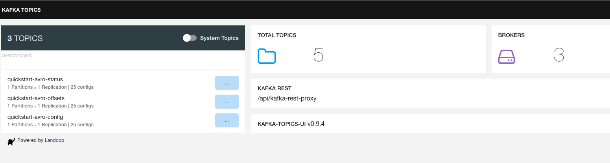

## **Lab 01: Kafka Connect Setup & Creation of Internal Topics**

## Description

In this lab, you will setup the lab environment and create the internal topics used by Kafka Connect. The lab environment consists of a container network created by Docker Compose. The Docker Compose file allows us to spin up a Kafka platform to run the application locally. All you should need to create the environment is Docker installed and running.

## Lab Instructions

## **Part 1: Forking, cloning, and adding upstream to the project**

1.	Navigate to the following url: 

        https://github.com/raghaviCJanaswamy/kafkaconnect-source-sink-trial.git

2.	Fork the project to your own GitHub account.

    a.	Click the Fork button.
        
    b.	Select the account to which the project will be forked.

3.	Clone the forked repo to your workstation: 

        git clone <fork-url>

## **Part 2: Starting the Kafka Platform**

The root directory of the project has a docker compose yaml file that allows you to spin up all the components of the Kafka platform with a simple command. Once the command is run, docker compose will spin up the following components:

    •	Kafka
    •	Zookeeper
    •	Schema Registry
    •	Kafka UI
    •	MySQL DB

Occasionally, a container may crash, and you will notice odd behavior in the platform. If this occurs, you can resolve the issue by running <b>docker-compose up -d </b> command.

1.	Make sure Docker is running on your system.
   2.	Execute the command: 

         docker compose -f docker-compose-mac.yml up -d

3.	Once the containers are spun up, complete the following tests to ensure the services are up and running.

4. Test the Kafka UI by navigating to     [Kafka Console - http://localhost:8000](http://localhost:8000)

5. Test the MySQL DB UI by navigating   [MySQL Console - http://localhost:8090](http://localhost:8090)

                i.	Username: user
                ii.	Password: password
                iii.Server: db
                iv.	Database: db

6. Test the schema registry by navigating to 
 [Kafka - Schema Registry - http://localhost:8081](http://localhost:8081)

## **Part 3: Create Internal Topics Used by Kafka Connect**

Now that we have the Kafka platform up and running, we need to create the internal Kafka topics that will be used by Kafka Connect. All Kafka Connect clusters require three internal topics: 

    a) The Config topic stores connector and task configuration data
    b) The Offset topic stores offset data for connectors 
    c) The Status topic stores status updates for connectors and tasks
    
The config topic should always be a single partition and be highly replicated. The offset topic should have a large number of partitions and be highly replicated, and the status topic can have multiple partitions and should be highly replicated.

### 1.	Create the Config topic by entering the following:

    docker run \
    --net=host \
    --rm \
    confluentinc/cp-kafka:5.0.0 \
    kafka-topics --create --topic quickstart-avro-offsets  --partitions 1 --replication-factor 1 --config "cleanup.policy=compact" --if-not-exists --zookeeper localhost:2181

### 2.	Create the Offsets topic by entering the following:

    docker run \
    --net=host \
    --rm \
    confluentinc/cp-kafka:5.0.0 \
    kafka-topics --create --topic quickstart-avro-config  --partitions 1 --replication-factor 1 --config "cleanup.policy=compact" --if-not-exists --zookeeper localhost:2181

### 3.	Create the Status topic by entering the following

    docker run \
      --net=host \
      --rm \
      confluentinc/cp-kafka:5.0.0 \
      kafka-topics --create --topic quickstart-avro-status  --partitions 1 --replication-factor 1 --config "cleanup.policy=compact" --if-not-exists --zookeeper localhost:2181

##  **Checkpoints** 
[Kafka Console - http://localhost:8000](http://localhost:8000)

