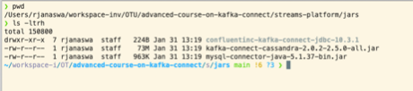
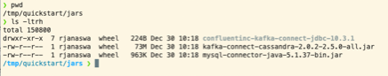
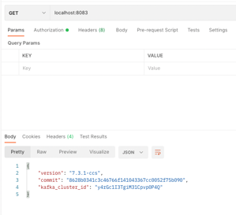

## **Lab 02: Source Connectors to push data from MySQL to Kafka**
## Description
In this lab, you will setup the source connectors, insert data into the MySQL database, start the Kafka Connect Cluster, and start the sink connector. At the end of the lab, you will have the source connector connected to the Kafka Connect Cluster. In addition, a new Kafka topic will be generated by the source connector with the data from the MySQL database posted to the topic.

### **Lab Instructions**

## **Part 1: Move Jars** 

        from Git repo location jars folder to /tmp/quickstart/jars

• There are 3 jar files/folders located in “Jar” folder under the git repository.

• These are the source, sink connectors along with driver libraries required to move the data to and from kafka.

In this section, the directory structure - /tmp/quickstart/jars needs to be created and all jars and its folders located in the git repo location needs to be moved under this folder. Please refer to the screenshots:

a) Make the directory structure

b) Navigate to streams-platform git repo’s jar folder and Copy jars from this location to /tmp/quickstart/jars and verify the folder structure matches git repo’s structure.

**Note**: It is not necessary to move these jars into a different location, however, changes in the later part of labs need to be performed in order to properly start the kaka connector.
** Checkpoint**

### **Part 2: Insert Data into MySQL Database**

1.	Access the MySQL UI: [http://localhost:8090](http://localhost:8090)
2.	Create a new database by entering the following:
 

    DROP TABLE IF EXISTS test;
    
    
        CREATE TABLE IF NOT EXISTS test (
          id serial NOT NULL PRIMARY KEY,
          name varchar(100),
          email varchar(200),
          department varchar(200),
          modified timestamp default CURRENT_TIMESTAMP NOT NULL,
          INDEX `modified_index` (`modified`)
        );
    
        INSERT INTO test(name, email, department) VALUES ('alice1', 'alice@abc.com', 'engineering');
        INSERT INTO test (name, email, department) VALUES ('bob1', 'bob@abc.com', 'sales');
        INSERT INTO test (name, email, department) VALUES ('bob2', 'bob@abc.com', 'sales');
        INSERT INTO test (name, email, department) VALUES ('bob3', 'bob@abc.com', 'sales');
        INSERT INTO test (name, email, department) VALUES ('bob4', 'bob@abc.com', 'sales');
        INSERT INTO test (name, email, department) VALUES ('bob5', 'bob@abc.com', 'sales');
        INSERT INTO test (name, email, department) VALUES ('bob7', 'bob@abc.com', 'sales');
        INSERT INTO test (name, email, department) VALUES ('bob8', 'bob@abc.com', 'sales');
        INSERT INTO test (name, email, department) VALUES ('bob9', 'bob@abc.com', 'sales');

** Checkpoint**  Verify the database records

### **Part 3: Start the Kafka Connect Cluster**

   1.	Open a new terminal.
   2.	Enter the following:

            docker run  \
            --name=kafka-connect-avro-1 \
            --network=streams-platform_default \
            -e CONNECT_BOOTSTRAP_SERVERS=broker1:19092 \
            -e CONNECT_REST_PORT=8083 \
            -e CONNECT_GROUP_ID="quickstart-avro-1" \
            -e CONNECT_CONFIG_STORAGE_TOPIC="quickstart-avro-config" \
            -e CONNECT_OFFSET_STORAGE_TOPIC="quickstart-avro-offsets" \
            -e CONNECT_STATUS_STORAGE_TOPIC="quickstart-avro-status" \
            -e CONNECT_CONFIG_STORAGE_REPLICATION_FACTOR=1 \
            -e CONNECT_OFFSET_STORAGE_REPLICATION_FACTOR=1 \
            -e CONNECT_STATUS_STORAGE_REPLICATION_FACTOR=1 \
            -e CONNECT_KEY_CONVERTER="io.confluent.connect.avro.AvroConverter" \
            -e CONNECT_VALUE_CONVERTER="io.confluent.connect.avro.AvroConverter" \
            -e CONNECT_KEY_CONVERTER_SCHEMA_REGISTRY_URL="http://schema-registry:8081" \
            -e CONNECT_VALUE_CONVERTER_SCHEMA_REGISTRY_URL="http://schema-registry:8081" \
            -e CONNECT_INTERNAL_KEY_CONVERTER="org.apache.kafka.connect.json.JsonConverter" \
            -e CONNECT_INTERNAL_VALUE_CONVERTER="org.apache.kafka.connect.json.JsonConverter" \
            -e CONNECT_REST_ADVERTISED_HOST_NAME="localhost" \
            -e CONNECT_LOG4J_ROOT_LOGLEVEL=INFO \
            -e CONNECT_PLUGIN_PATH=/usr/share/java,/etc/kafka-connect/jars \
            -v /tmp/quickstart/files:/tmp/quickstart \
            -v /tmp/quickstart/jars:/etc/kafka-connect/jars \
            --publish 8083:8083 \
            docker.repo1.uhc.com/confluentinc/cp-kafka-connect:latest

## **Checkpoint** 

Verify Kafka connect cluster has started:

[http://localhost:8083](http://localhost:8083)

### Part 4: Start the Source Connector

1.	Enter the following to add configuration to start source connector:

        curl -X POST \
        -H "Content-Type: application/json" \
        --data '{ "name": "quickstart-jdbc-source", "config": { "connector.class": "io.confluent.connect.jdbc.JdbcSourceConnector", "tasks.max": 1, "connection.url": "jdbc:mysql://streams-platform-db-1:3306/db?user=user&password=password", "mode": "incrementing", "incrementing.column.name": "id", "timestamp.column.name": "modified", "topic.prefix": "AKK_", "poll.interval.ms": 1000 , "transforms": "ValueToKey","transforms.ValueToKey.type":"org.apache.kafka.connect.transforms.ValueToKey","transforms.ValueToKey.fields":"name"} }' \
        http://127.0.0.1:8083/connectors

## **Checkpoint** 

Verify the connectors created. 

2.	This starts the source connector which connects to the MySQL database and creates a Kafka topic prefixed with AKK_test with values taken from the MySQL database.

3.	Verify kafka connect source connector is correctly added: This can be checked by going to the ^^ http url. 

## **Checkpoint** 
Verify the Kafka Topic Created with the data in the topics.

## **Checkpoint** 
Verify Data in Kafka Topic

