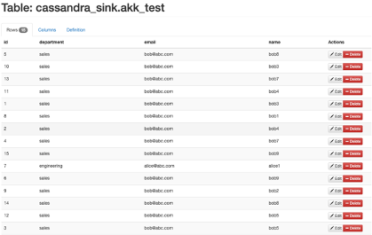

## **Lab 03: Sink Connector to push data from kafka - Cassandra**
## Description
In this lab, you will setup the Cassandra database and create the sink connector which connects Cassandra to the Kafka Connect cluster. This is the final step in connecting the MySQL and Cassandra databases using Kafka Connect.

### **Lab Instructions**

### **Part 1: Setup and Test Cassandra**

1.	Enter the following to view the docker network: 

        docker network ls

2.	Find the streams_platform network name and run: docker network inspect <streams_platform network name>
3.	This displays all the internal network configurations for the docker network. Locate the IPV4 address of Cassandra. Run the following command and insert the IPV4 address for the Cassandra_Host_IP:

        docker run -d \
        --network=streams-platform_default \
        -e CASSANDRA_HOST_IP=172.21.0.3  \
        -e CASSANDRA_PORT=9042 \
        -p 3000:3000 \
        --name cassandra-web \
        delermando/docker-cassandra-web:v0.4.0

4.	Check to make sure the database is working by navigating to 

        http://localhost:3000

5.	Create a keyspace by running: 

        CREATE KEYSPACE test WITH replication = {'class': 'SimpleStrategy', 'replication_factor': '3'} AND durable_writes = true;

### **Part 2: Create the Database and the table in C***

a) Navigate to Cassandra UI: 
        http://localhost:3000

b) Create the database: Cassandra_sink using the following DDL:

    CREATE KEYSPACE cassandra_sink WITH replication = {'class': 'SimpleStrategy', 'replication_factor': '2'} AND durable_writes = true;

c) Create the table: akk_test under the above database by executing the following:

    CREATE TABLE cassandra_sink.AKK_test (
    id int,
    name text,
    email text,
    department text,
    PRIMARY KEY (id))

### **Part 3: Stop running kafka connector and restart with Cassandra connection env variables:**
    docker run  \
    --name=kafka-connect-avro-1 \
    --network=streams-platform_default \
    -e CONNECT_BOOTSTRAP_SERVERS=broker1:19092 \
    -e CONNECT_REST_PORT=8083 \
    -e CONNECT_GROUP_ID="quickstart-avro" \
    -e CONNECT_CONFIG_STORAGE_TOPIC="quickstart-avro-config" \
    -e CONNECT_OFFSET_STORAGE_TOPIC="quickstart-avro-offsets" \
    -e CONNECT_STATUS_STORAGE_TOPIC="quickstart-avro-status" \
    -e CONNECT_CONFIG_STORAGE_REPLICATION_FACTOR=1 \
    -e CONNECT_OFFSET_STORAGE_REPLICATION_FACTOR=1 \
    -e CONNECT_STATUS_STORAGE_REPLICATION_FACTOR=1 \
    -e CONNECT_KEY_CONVERTER="io.confluent.connect.avro.AvroConverter" \
    -e CONNECT_VALUE_CONVERTER="io.confluent.connect.avro.AvroConverter" \
    -e CONNECT_KEY_CONVERTER_SCHEMA_REGISTRY_URL="http://schema-registry:8081" \
    -e CONNECT_VALUE_CONVERTER_SCHEMA_REGISTRY_URL="http://schema-registry:8081" \
    -e CONNECT_INTERNAL_KEY_CONVERTER="org.apache.kafka.connect.json.JsonConverter" \
    -e CONNECT_INTERNAL_VALUE_CONVERTER="org.apache.kafka.connect.json.JsonConverter" \
    -e CONNECT_REST_ADVERTISED_HOST_NAME="localhost" \
    -e CONNECT_LOG4J_ROOT_LOGLEVEL=INFO \-e connect_cassandra_contact_point="cassandra" \
    -e connect_cassandra_port="9042" \
    -e connect_cassandra_username="" \
    -e connect_cassandra_password="" \
    -e CONNECT_PLUGIN_PATH=/usr/share/java,/etc/kafka-connect/jars \
    -v /tmp/quickstart/files:/tmp/quickstart \
    -v /tmp/quickstart/jars:/etc/kafka-connect/jars \
    --publish 8083:8083 \
    docker.repo1.uhc.com/confluentinc/cp-kafka-connect:latest

In above command Cassandra connection configuration is passed. This is necessary for the custom lenses sink connector we are using to push data from kafka to Cassandra.

### **Part 4: Create and run sink connector configuration**

Following is the JSON for Cassandra sink connector:

    {
    "name": "test-sink-1",
    "config": {
    "name": "test-sink-1",
    "connector.class": "com.datamountaineer.streamreactor.connect.cassandra.sink.CassandraSinkConnector",
    "connect.cassandra.consistency.level": "ONE",
    "connect.cassandra.key.space": "cassandra_sink",
    "tasks.max": "1",
    "connect.cassandra.contact.points": "cassandra",
    "connect.cassandra.port": "9042",
    "value.converter": "io.confluent.connect.avro.AvroConverter",
    "connect.cassandra.retry.interval": "1000",
    "connect.cassandra.default.value": "UNSET",
    "topics": "AKK_test",
    "connect.cassandra.kcql": "INSERT INTO akk_test SELECT id,name,email,department FROM AKK_test;",
    "columns.list.csv": "id:int,name:string,email:string,department:string",
    "connect.cassandra.connect.timeout": "10000",
    "connect.cassandra.connect.timeout.ms": "10000",
    "connect.cassandra.ssl.enabled": "false",
    "connect.progress.enabled": "true",
    "connect.cassandra.max.retries": "3",
    "connect.cassandra.error.policy": "retry",
    "connect.cassandra.connection.timeout.ms": "10000",
    "connect.cassandra.threadpool.size": "1",
    "key.converter": "io.confluent.connect.avro.AvroConverter",
    "key.converter.schema.registry.url": "http://schema-registry:8081",
    "value.converter.schema.registry.url": "http://schema-registry:8081"
    }
    }

This can be run via postman POST call as in below screenshot:

Alternatively, the configuration can also be passed as part of a curl command as below:

    curl -X POST \
    -H "Content-Type: application/json" \
    --data ‘{"name": "test-sink-1","config": {"name": "test-sink-1","connector.class": "com.datamountaineer.streamreactor.connect.cassandra.sink.CassandraSinkConnector","connect.cassandra.consistency.level": "ONE","connect.cassandra.key.space": "cassandra_sink","tasks.max": "1","connect.cassandra.contact.points": "cassandra","connect.cassandra.port": "9042","value.converter": "io.confluent.connect.avro.AvroConverter","connect.cassandra.retry.interval": "1000", "connect.cassandra.default.value": "UNSET","topics": "AKK_test","connect.cassandra.kcql": "INSERT INTO test_table SELECT id,name,email,department FROM AKK_test;","columns.list.csv": "id:int,name:string,email:string,department:string","connect.cassandra.connect.timeout": "10000","connect.cassandra.connect.timeout.ms": "10000","connect.cassandra.ssl.enabled": "false","connect.progress.enabled": "true","connect.cassandra.max.retries": "3","connect.cassandra.error.policy": "retry","connect.cassandra.connection.timeout.ms": "10000","connect.cassandra.threadpool.size": "1","key.converter": "io.confluent.connect.avro.AvroConverter","key.converter.schema.registry.url": "http://schema-registry:8081","value.converter.schema.registry.url": “http://schema-registry:8081”}}’ \  http://127.0.0.1:8083/connectors

## **Checkpoint** 

Once the connector is successfully running, Go to the Cassandra UI to check if the records are available. 
 

## **Checkpoint** 

Verify Sink Connector working

